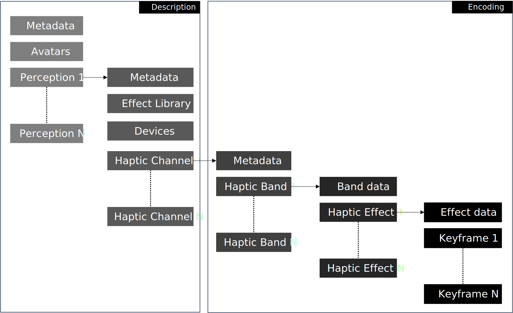
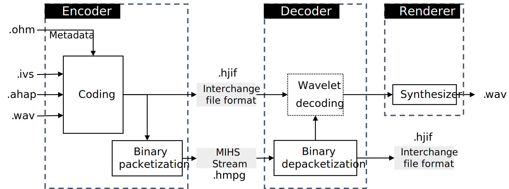
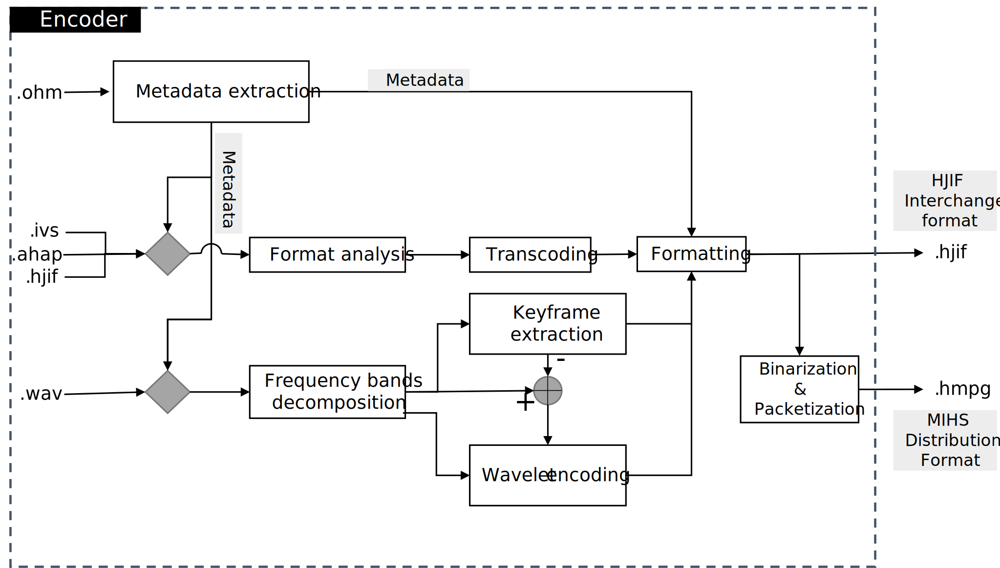

# MPEG Haptics Reference Model

> This project contains the reference software for the codec of the standard ISO/IEC DIS 23090-31 on a Coded Representation of Haptics - Phase 1. 
>
> It is based on a reference model that was established in collaboration between **InterDigital Corporation**, **Technical University of Munich** and **Interhaptics**. This project contains 3 reference software corresponding to an encoder, a decoder and a synthesizer.

> The software coordinators are the following:
- Alexandre Hulsken (InterHaptics): alexandre.hulsken@interhaptics.com
- Quentin Galvane (InterDigital): quentin.galvane@interdigital.com
- Lars Nockenberg (TUM): lars.nockenberg@tum.de

---

## Table of Contents

[[_TOC_]]

---

This git is decomposed into 3 majors folders:

+ **RM_Encoder:** *this C++ project is able to ingest a reference file format (AHAP, IVS and WAV) and encode it in the RM format (human-readable or binary-compressed)*
+ **RM_Decoder:** *this C++ project is able to ingest an RM0 file binary compressed and transcode it into the human-readable format*
+ **RM_Synthesizer** *this project (coding language to determine) is able to ingest an RM0 file in human-readable format and generate a wav file corresponding to the appropriate haptic feedback*

## Build instructions

This piece of software requires Windows 10 with Visual Studio 2019, or Linux with gcc-10/clang-11. Git and cmake are needed to clone and generate the project. Instructions are provided in [doc/building.md](doc/building.md).

## Versions

The master branch contains the last released version of the software.
The develop branch contains the current version under development.
The different versions of the software are referenced with specific tags and can be fetched using the assossiated commit id. All versions of the reference software are listed  [here](https://mpeg.expert/software/MPEG/3dgh/haptics/software/ReferenceSoftwarePhase1/-/tags).

## Usage

A successul build  will produce the three *Encoder*, *Decoder* and *Synthesizer* executables, in the build/source/[Encoder|Decoder|Synthesizer] folder. Runtime instructions are provided in [doc/usage.md](doc/usage.md)

## Contributing

### Workflow

If you are willing to contribute to the project, please follow this workflow:

1. Create an issue with the appropriate label, documentation, contribution number, etc. Issues can be created from the left panel menu: [Issues/List](https://mpeg.expert/software/MPEG/3dgh/haptics/software/ReferenceSoftwarePhase1/-/issues), New issue button.
2. Fork a branch from *develop* as indicated in the *Git* section
3. Work in your branch. Make sure that the code is compliant with the [coding style](doc/coding_style.md), and the [unit tests](doc/testing.md) are running. Add tests dedicated to your new code.
4. Commit you work in this branch according to the commit convention
5. Push your branch to the repo. A branch can be pushed at any time, no need for the task to be completed
6. Once the task is complete and all the code committed, request a merge. Go the left panel menu: [Repository/Branches](https://mpeg.expert/software/MPEG/3dgh/haptics/software/ReferenceSoftwarePhase1/-/branches), Merge request button associated to your branch
7. A software coordinator will review the code and merge the branch if all the rules are respected, and all the tests are ok. The branch will be then deleted.
8. Close the issue.

### Coding style

The coding style and rules can be found in [doc/coding_style.md](doc/coding_style.md). The use of the these rules is mandatory for all software implementation work. Changes that do not comply with these rules will not be accepted by the software coordinators.

### Git

Branching architecture and commmit convention are described in section [doc/git.md](doc/git.md).

### Testing

Unit tests are described in section [doc/testing.md](doc/testing.md).

## File format data structure

The standard ISO/IEC DIS 23090-31 defines a coded representation of haptics based on a data model that enables the encoding of both descriptive and quantized haptic data. Two complementary formats are detailed in the specifications: an interchange format (.hjif) based on JSON, and a packetized compressed binary format for streaming that can also be stored in a binary file (.hmpg). These two formats are based on the same hierarchical data structure:

---

## Software architecture

### RM codec architecture
The overall codec architecture is detailed in the following Figure:

### RM Encoder structure
The detailed encoder architecture is detailed in the following Figure:

---

