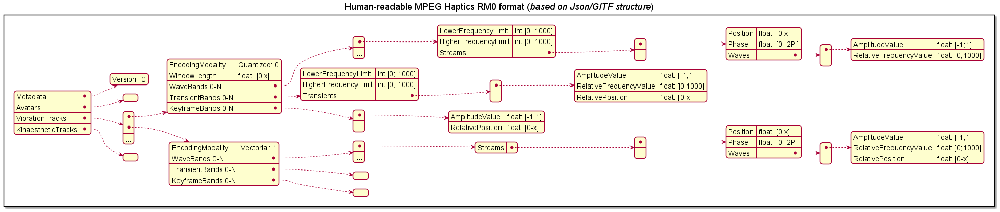

# MPEG Haptics RM0

---

## Git notes

This git is decomposed into 3 majors folders:

+ **RM0_Encoder:** *this C++ project is able to ingest a reference file format (AHAP, IVS and WAV) and encode it in the RM0 format (human-readable or binary-compressed)*
+ **RM0_Decoder:** *this C++ project is able to ingest an RM0 file binary compressed and transcode it into the human-readable format*
+ **RM0_Synthetizer** *this project (coding language to determine) is able to ingest an RM0 file in human-readable format and generate a wav file corresponding to the appropriate haptic feedback*

The proposed git workflow for the current project is described below.

#### Commit convention

```shell
$ git commit -m "<optional WIP> <type>(<optional scope>): <description>"
```

The optional WIP information is to indicate your commit is in the “Work In Progress” state.

Type possible:
+ **feat:** *The new feature you’re adding to a particular application*
+ **fix:** *A bug fix*
+ **hotfix:** *A bug fix to correct a major issue*
+ **style:** *Feature and updates related to styling*
+ **refacto:** *Refactoring a specific section of the codebase*
+ **test:** *Everything related to testing*
+ **doc:** *Everything related to documentation*
+ **chore:** *Regular code maintenance [something which not fit with other previous types]*

#### Branch convention

##### Branch creation

```shell
$ git branch <type>/<initials>_<why>
```

+ **type:** *Everything which can work for a commit message*
+ **initials:** *Initials of the owner*
+ **why:** *The purpose of this branch written in PascalCase*

##### Branch update

When 2 developers work on the same project, they will have each a working branch. If one merge his work on develop the second one should update his work to fit with the new develop state. It exists 2 possible ways to resolve this situation:

+ Rebasing develop to the working branch (recommended solution)
    ```shell
    $ git checkout <my_branch_name>
    $ git rebase develop
    ```
+ Merging develop to the working branch (recommended solution)
    ```shell
    $ git checkout <my_branch_name>
    $ git merge develop
    ```

On the other hand, when a working branch is finished and needs to move into *develop*. A `pull request` need to be generated directly on Github. Once completed in the platform, the working branch will be merged into *develop*.  

##### Tree model


---

## File structure

### Human-readable format



### Human-readable format


---

## Software architecture


### RM0 Encoder structure


### RM0 Decoder structure


