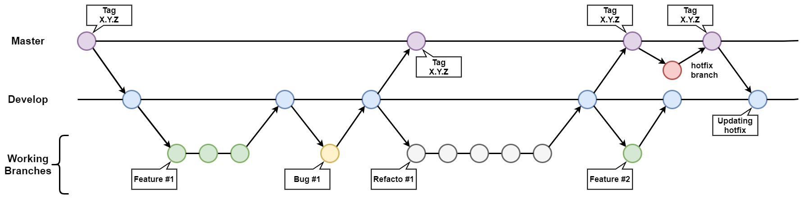

# MPEG Haptics Reference Model


> This project answer the Call for Proposals (CfP) on a Coded Representation of Haptics - Phase 1 (*refs. m56255_v6*).
>
> A reference model is proposed in collaboration between **InterDigital Corporation**, **Technical University of Munich** and **Interhaptics** in this repository. This project contains 3 reference software corresponding to an encoder, a decoder and a synthesizer.

---

## Table of Contents

[[_TOC_]]

---

This git is decomposed into 3 majors folders:

+ **RM0_Encoder:** *this C++ project is able to ingest a reference file format (AHAP, IVS and WAV) and encode it in the RM0 format (human-readable or binary-compressed)*
+ **RM0_Decoder:** *this C++ project is able to ingest an RM0 file binary compressed and transcode it into the human-readable format*
+ **RM0_Synthesizer** *this project (coding language to determine) is able to ingest an RM0 file in human-readable format and generate a wav file corresponding to the appropriate haptic feedback*

## How to use

This pieces of software requires Windows 10, Visual Studio 2019, cmake, and git.

### Clone

To clone the current project in your working setup simply follows the list of commands below:

```shell
git clone https://github.com/Interhaptics/MPEG_Haptics_RM0.git
```

***<u>Note :</u>*** The previous command clone the project through *HTTPS* protocol, but the *SSH* one is still possible. To do it, you simply need to replace use this other command:

```shell
git clone git@github.com:Interhaptics/MPEG_Haptics_RM0.git
``` 

### Compilation

<!-- TODO

```shell

```

-->

---

## File structure

### Human-readable format


### Binary bitstream format


---

## Software architecture


### RM0 Encoder structure


### RM0 Decoder structure


---

## Git notes

### Commit convention

```shell
git commit -m "<optional WIP> <type>(<optional scope>): <description>"
```

The optional WIP information is to indicate your commit is in the “Work In Progress” state.

Type possible:
+ **feat:** *The new feature you’re adding to a particular application*
+ **fix:** *A bug fix*
+ **hotfix:** *A bug fix to correct a major issue*
+ **style:** *Feature and updates related to styling*
+ **refacto:** *Refactoring a specific section of the codebase*
+ **test:** *Everything related to testing*
+ **doc:** *Everything related to documentation*
+ **chore:** *Regular code maintenance [something which not fit with other previous types]*

### Branch convention

#### Branch creation

```shell
git branch <type>/<initials>_<why>
```

+ **type:** *Everything which can work for a commit message*
+ **initials:** *Initials of the owner*
+ **why:** *The purpose of this branch written in PascalCase*

#### Branch update

When 2 developers work on the same project, they will have each a working branch. If one merge his work on develop the second one should update his work to fit with the new develop state. It exists 2 possible ways to resolve this situation:

+ Rebasing develop to the working branch (recommended solution)
    ```shell
    git checkout <my_branch_name>
    git rebase develop
    ```
+ Merging develop to the working branch (recommended solution)
    ```shell
    git checkout <my_branch_name>
    git merge develop
    ```

On the other hand, when a working branch is finished and needs to move into *develop*. A `pull request` need to be generated directly on Github. Once completed in the platform, the working branch will be merged into *develop*.

#### Tree model


