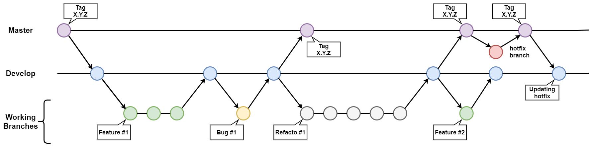

## Git rules

### Commit convention

```shell
git commit -m "<optional WIP> <type>(#<issue id> <optional scope>): <description>"
```

The optional WIP information is to indicate your commit is in the “Work In Progress” state. Issue id is given in the [Issue panel](http://mpegx.int-evry.fr/software/haptics/rm0/-/issues).

Type possible:
+ **feat:** *The new feature you’re adding to a particular application*
+ **fix:** *A bug fix*
+ **hotfix:** *A bug fix to correct a major issue*
+ **style:** *Feature and updates related to styling*
+ **refacto:** *Refactoring a specific section of the codebase*
+ **test:** *Everything related to testing*
+ **doc:** *Everything related to documentation*
+ **chore:** *Regular code maintenance [something which not fit with other previous types]*

### Branch convention

#### Branch creation

```shell
git branch <type>/<initials>_<why>
```

+ **type:** *Everything which can work for a commit message*
+ **initials:** *Initials of the owner*
+ **why:** *The purpose of this branch written in PascalCase*

#### Branch update

When 2 developers work on the same project, they will have each a working branch. If one merge his work on develop the second one should update his work to fit with the new develop state. It exists 2 possible ways to resolve this situation:

+ Rebasing develop to the working branch (recommended solution)
    ```shell
    git checkout <my_branch_name>
    git rebase develop
    ```
+ Merging develop to the working branch (recommended solution)
    ```shell
    git checkout <my_branch_name>
    git merge develop
    ```

On the other hand, when a working branch is finished and needs to move into *develop*. A `pull request` need to be generated directly on Github. Once completed in the platform, the working branch will be merged into *develop*.

#### Tree model


